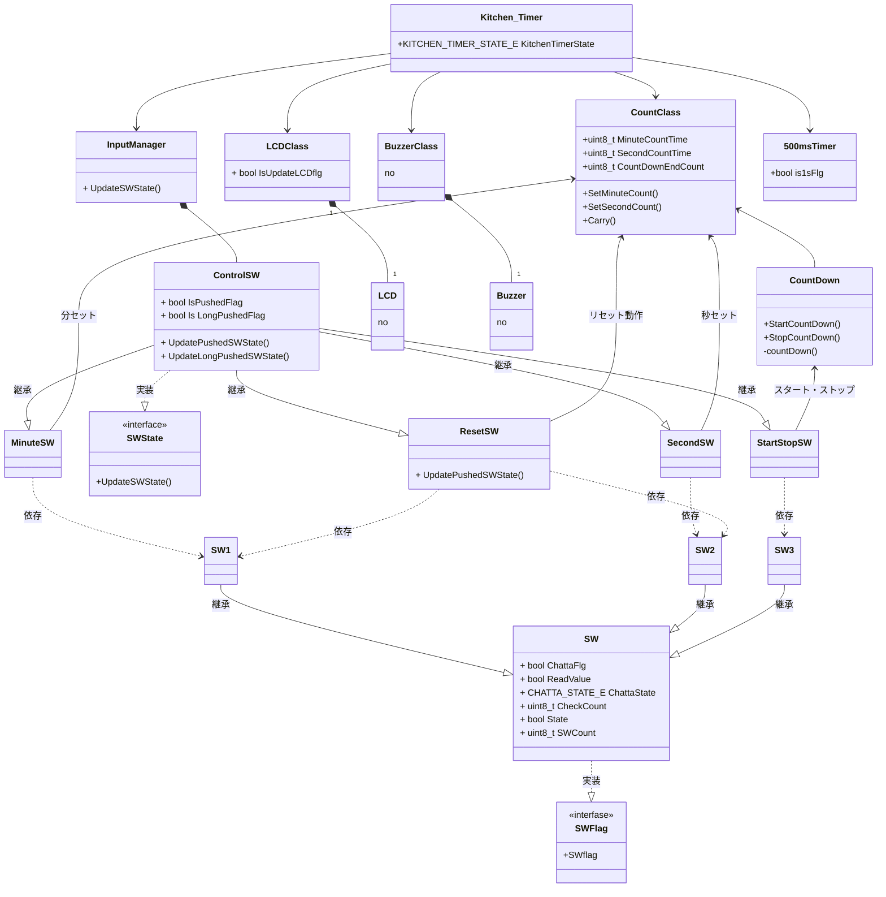

# クラス図 - mermaid

```mermaid

classDiagram

class Kitchen_Timer{
    +KITCHEN_TIMER_STATE_E KitchenTimerState
}

class InputManager{
    + UpdateSWState()
}
class ControlSW{
    + bool IsPushedFlag
    + bool Is LongPushedFlag

    + UpdatePushedSWState()
    + UpdateLongPushedSWState()
}

class ResetSW{
    + UpdatePushedSWState()
}


class CountClass{
    +uint8_t MinuteCountTime
    +uint8_t SecondCountTime
    +uint8_t CountDownEndCount

    +SetMinuteCount()
    +SetSecondCount()
    +Carry()
}


class CountDown{
    +StartCountDown()
    +StopCountDown()
    -countDown()
}

class SWState{
    <<interface>>

    +UpdateSWState()
}

class SWFlag{
    <<interfase>>
    +SWflag
}

class SW{
    + bool ChattaFlg
    + bool ReadValue
    + CHATTA_STATE_E ChattaState
    + uint8_t CheckCount
    + bool State
    + uint8_t SWCount
}

class LCDClass{
    + bool IsUpdateLCDflg
}
class LCD{
    no
}

class BuzzerClass{
    no
}

class Buzzer{
    no
}

class 500msTimer{
    +bool is1sFlg
}

Kitchen_Timer --> 500msTimer
Kitchen_Timer --> InputManager
InputManager *-- ControlSW


ControlSW --|> MinuteSW : 継承
ControlSW --|> SecondSW : 継承
ControlSW --|> ResetSW : 継承
ControlSW --|> StartStopSW : 継承

ControlSW ..|> SWState : 実装

MinuteSW ..> SW1 : 依存
SecondSW ..> SW2 : 依存
ResetSW ..> SW1 : 依存
ResetSW ..> SW2 : 依存
StartStopSW ..> SW3 : 依存

SW ..|> SWFlag : 実装

SW1 --|> SW : 継承
SW2 --|> SW : 継承
SW3 --|> SW : 継承

%%MinuteSW --|> ControlSW : 継承
%%SecondSW --|> ControlSW : 継承
%%ResetSW --|> ControlSW : 継承
%%StartStopSW --|> ControlSW : 継承


Kitchen_Timer --> CountClass

CountClass <-- CountDown
CountClass <-- MinuteSW : 分セット
CountClass <-- SecondSW : 秒セット
CountClass <-- ResetSW : リセット動作

CountDown <-- StartStopSW : スタート・ストップ


Kitchen_Timer --> LCDClass

LCDClass "1" *-- "1" LCD


Kitchen_Timer --> BuzzerClass
BuzzerClass *-- "1" Buzzer


```