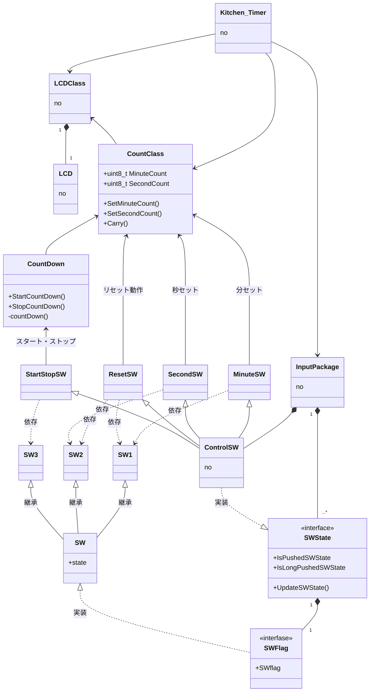

# クラス図 - mermaid

```mermaid

classDiagram

class Kitchen_Timer{
    no
}


class InputPackage{
    no
}
class ControlSW{
    no
}
class LCDClass{
    no
}
class LCD{
    no
}

class CountClass{
    +uint8_t MinuteCount
    +uint8_t SecondCount

    +SetMinuteCount()
    +SetSecondCount()
    +Carry()
}


class CountDown{
    +StartCountDown()
    +StopCountDown()
    -countDown()
}

class SWState{
    <<interface>>
    +IsPushedSWState
    +IsLongPushedSWState

    +UpdateSWState()
}

class SWFlag{
    <<interfase>>
    +SWflag
}


Kitchen_Timer --> InputPackage
Kitchen_Timer --> CountClass


InputPackage "1" *-- "...*"SWState
InputPackage *-- ControlSW

ControlSW ..|> SWState : 実装


class SW{
    +state
}


SW1 <|-- SW : 継承
SW2 <|-- SW : 継承
SW3 <|-- SW : 継承

MinuteSW ..> SW1 : 依存
ResetSW ..> SW1 : 依存
ResetSW ..> SW2 : 依存
SecondSW ..> SW2 : 依存
StartStopSW ..> SW3 : 依存

MinuteSW <|-- ControlSW
SecondSW <|-- ControlSW
ResetSW <|-- ControlSW
StartStopSW <|-- ControlSW

CountClass <-- MinuteSW : 分セット
CountClass <-- SecondSW : 秒セット
CountClass <-- ResetSW : リセット動作

CountClass <-- CountDown

CountDown <-- StartStopSW : スタート・ストップ


SWState "1" *-- "1" SWFlag
SW <|.. SWFlag : 実装

Kitchen_Timer --> LCDClass
LCDClass "1" *-- "1" LCD

LCDClass <-- CountClass


```