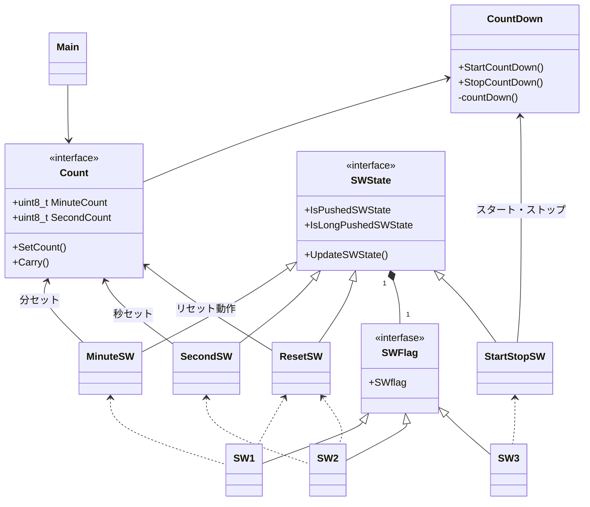

# クラス図 - mermaid

```mermaid

classDiagram

class Main

class Count{
    <<interface>>
    +uint8_t MinuteCount
    +uint8_t SecondCount

    +SetCount()
    +Carry()
}

class CountDown{
    +StartCountDown()
    +StopCountDown()
    -countDown()
}

class SWState{
    <<interface>>
    +IsPushedSWState
    +IsLongPushedSWState
    
    +UpdateSWState()
}

class SWFlag{
    <<interfase>>
    +SWflag
}

Main --> Count

CountDown <-- Count

SWState <|-- MinuteSW
SWState <|-- SecondSW
SWState <|-- ResetSW
SWState "1" *-- "1" SWFlag
SWState <|-- StartStopSW

CountDown <-- StartStopSW : スタート・ストップ

SWFlag <|-- SW1
SWFlag <|-- SW2
SWFlag <|-- SW3

ResetSW <.. SW1
ResetSW <.. SW2

MinuteSW <.. SW1
SecondSW <.. SW2
StartStopSW <.. SW3

Count <-- MinuteSW : 分セット
Count <-- SecondSW : 秒セット
Count <-- ResetSW : リセット動作

```