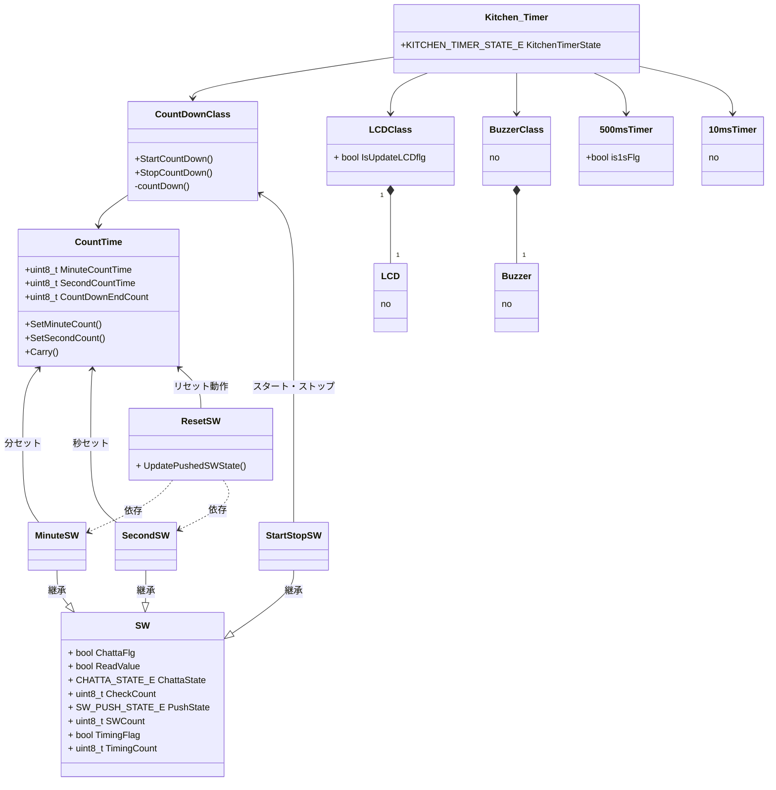

# クラス図 - mermaid

```mermaid

classDiagram

class Kitchen_Timer{
    +KITCHEN_TIMER_STATE_E KitchenTimerState
}


class ResetSW{
    + UpdatePushedSWState()
}


class CountTime{
    +uint8_t MinuteCountTime
    +uint8_t SecondCountTime
    +uint8_t CountDownEndCount

    +SetMinuteCount()
    +SetSecondCount()
    +Carry()
}


class CountDownClass{
    +StartCountDown()
    +StopCountDown()
    -countDown()
}


class SW{
    + bool ChattaFlg
    + bool ReadValue
    + CHATTA_STATE_E ChattaState
    + uint8_t CheckCount
    + SW_PUSH_STATE_E PushState
    + uint8_t SWCount
    + bool TimingFlag
    + uint8_t TimingCount
}

class LCDClass{
    + bool IsUpdateLCDflg
}
class LCD{
    no
}

class BuzzerClass{
    no
}

class Buzzer{
    no
}

class 500msTimer{
    +bool is1sFlg
}

class 10msTimer{
    no
}

ResetSW ..> MinuteSW : 依存
ResetSW ..> SecondSW : 依存


MinuteSW --|> SW : 継承
SecondSW --|> SW : 継承
StartStopSW --|> SW : 継承


Kitchen_Timer --> CountDownClass


CountDownClass --> CountTime

CountTime <-- MinuteSW : 分セット
CountTime <-- SecondSW : 秒セット
CountTime <-- ResetSW : リセット動作

CountDownClass <-- StartStopSW : スタート・ストップ


Kitchen_Timer --> LCDClass

LCDClass "1" *-- "1" LCD


Kitchen_Timer --> BuzzerClass
BuzzerClass *-- "1" Buzzer


Kitchen_Timer --> 500msTimer
Kitchen_Timer --> 10msTimer


```